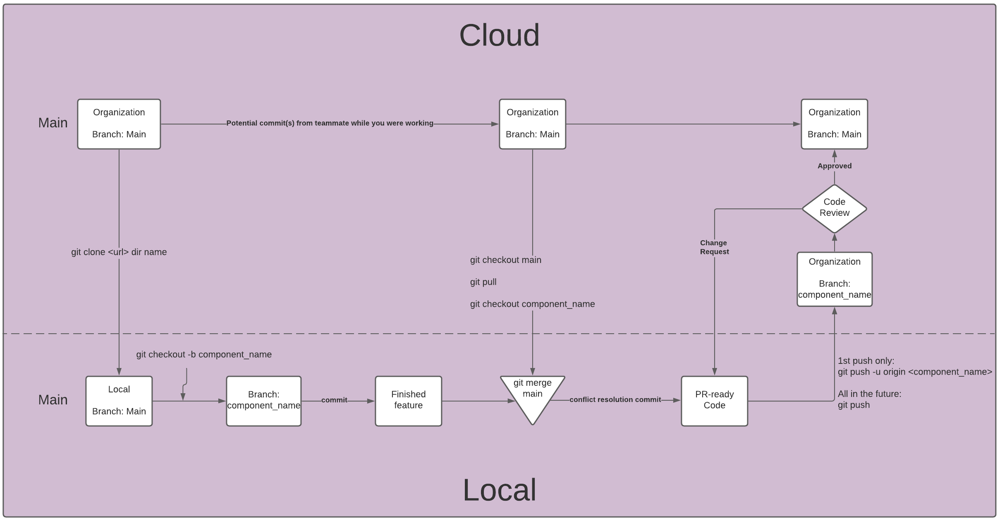

# Dorfdash

Blue Ocean project repository for RFP54's Project Gucci.

Dorfdash is a fullstack web application that aims to provide an tool for event planners to create events, and invite others to attend. We want to go further by facilitating ride sharing and do our part in promoting responsible driving.

---

## Set up Instructions

To run this single page application on your local machine:

1. Clone the main branch
2. Create your own `.env` file at the root, and populate it with your secrets for: `TBD`
3. Install dependencies

    ```bash
    yarn install
    ```

4. In one terminal, build the bundle

    - Single build:
      ```bash
      yarn run build
      ```
  
    - Watch:
      ```bash
      yarn run dev
      ```

5. In another terminal, start the server

    ```bash
    yarn run sttart
    ```

6. Visit [localhost:3000](http://localhost:3000) in the browser

---

## Want to contribute?



---

## Tech Stack

<code></code>

<code></code>

<code></code>

<code></code>

<code></code>

<code></code>

---
